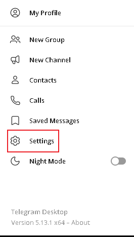

## Blum脚本使用教程

### 打开Telegram桌面端 `Enable Webview Inspecting`，网页版本跳过此步骤的配置，直接按 [使用脚本](#使用脚本) 步骤操作

- 点击左上角三条杠

  

- 点击 settings



- 点击 Advanced

  

- 下滑找到 Enable webview inspecting

  

- 打开 Enable webview inspecting

  

### 配置Blum脚本

#### Blum脚本

```javascript
const SCRIPT_VERSION="4.0";var _0xodm="jsjiami.com.v7";const _0x38aed6=_0x41f6;function _0x41f6(e,t){let i=_0x293b();return(_0x41f6=function(t,n){let o=i[t-=132];if(void 0===_0x41f6.GnNqHE){var a=function(e){let t="",i="";for(let n=0,o,a,r=0;a=e.charAt(r++);~a&&(o=n%4?64*o+a:a,n++%4)&&(t+=String.fromCharCode(255&o>>(-2*n&6))))a="abcdefghijklmnopqrstuvwxyzABCDEFGHIJKLMNOPQRSTUVWXYZ0123456789+/=".indexOf(a);for(let l=0,s=t.length;l<s;l++)i+="%"+("00"+t.charCodeAt(l).toString(16)).slice(-2);return decodeURIComponent(i)};let r=function(e,t){let i=[],n=0,o,r="";e=a(e);let l;for(l=0;l<256;l++)i[l]=l;for(l=0;l<256;l++)n=(n+i[l]+t.charCodeAt(l%t.length))%256,o=i[l],i[l]=i[n],i[n]=o;l=0,n=0;for(let s=0;s<e.length;s++)n=(n+i[l=(l+1)%256])%256,o=i[l],i[l]=i[n],i[n]=o,r+=String.fromCharCode(e.charCodeAt(s)^i[(i[l]+i[n])%256]);return r};_0x41f6.mNwRJB=r,e=arguments,_0x41f6.GnNqHE=!0}let l=i[0],s=t+l,c=e[s];return c?o=c:(void 0===_0x41f6.cTNJVD&&(_0x41f6.cTNJVD=!0),o=_0x41f6.mNwRJB(o,n),e[s]=o),o})(e,t)}(function(e,t,i,n,o,a,r){e>>=2,a="hs",r="hs",function(t,i,l,s,c){let d=_0x41f6;a=(s="tfi")+a,r+=c="up",a=l(a),r=l(r),l=0;let p=t();for(;--n+i;)try{s=parseInt(d(138,"N3g&"))/1+parseInt(d(147,"clOW"))/2*(-parseInt(d(141,"K[^S"))/3)+parseInt(d(134,"E6tj"))/4*(-parseInt(d(140,"wuTE"))/5)+-parseInt(d(139,"E5J)"))/6+-parseInt(d(142,"%pS3"))/7+parseInt(d(132,"7(bw"))/8+parseInt(d(137,")rkI"))/9}catch(u){s=l}finally{if(c=p[a](),e<=n)l?o?s=c:o=c:l=c;else if(l==o.replace(/[IwYtxGbfTFyOpVXqJeUQuB=]/g,"")){if(s===i){p["un"+a](c);break}p[r](c)}}}(i,567384,function(e,t,i,n,o,a,r){return t="split",e=arguments[0],(e=(e=e[t](""))[i="reverse"]("v"))[n="join"]("")})})(808,567384,_0x293b,204),_0x293b&&(_0xodm=`F9`);const SCRIPT_URL=_0x38aed6(136,")rkI");function _0x293b(){let e=[_0xodm,"GjTUsFYjuwVitaJFmBiO.ycfoempb.GXqvQ7JqIx==","WOuPDselih8U","WONcM8kiWRjigWBcN8oYzCkf","W6lcNwDBBSoBWRVdSfZcKmoc","cSocW4jrWR0xs8kcsJ1Njq","W5/cRdddTSobW7ZdUrpcTHv3wWK"].concat(["WPJcTa1VhCkHWP/dKKDBWQ7cV8oxWOK","W6GNWPHeW4uupSk7dq","tL8ZE8o6amkEr0BcH8op","WOWBW73dLNqGW4FdRSkvtqRcUSkwmNpcOuBcVCorFSkilheQW4qVWR97B8odwLRcOW/cVHBcT8oosGFdL1xcTGlcRSoKfSkDWOVdV1TcgwtdGx3dQmo4BCoPq8klzCkxWQRdTmk6EcVcVdFcJapcUSozvKG","W5vEWRNcLtuIW5NdS8kMBItdH8k0hG","W7/cOZtdOdCwW5xdOKRcLmoNga","lvVdNNZdT8oaW5tdNLahW77dVmoY"].concat(["W4y1WQ3cI8oNvYq4W6BdLCoN","kSk8W5jLW7FdPmkapq","xc3cLK7cHcxcJXj2WQeAWOpcMq","vIVcLuRcIIpcIdPfWPy7WPdcKW","kmk/WPb3W4tdSmkngCkq"]));return(_0x293b=function(){return e})()}var version_="jsjiami.com.v7";let GAME_SETTINGS={minBombHits:Math.floor(2*Math.random()),minIceHits:Math.floor(2*Math.random())+2,flowerSkipPercentage:Math.floor(11*Math.random())+15,minDelayMs:500,maxDelayMs:999,autoClickPlay:!1,dogsProbability:(98+Math.random())/100,checkForUpdates:!0,autoVideoTask:!0,autoVerifyCode:!1,autoClaimTask:!0};const answers={"How to Analyze Crypto":"VALUE","What’s DAO?":"N/A","Ton voices live":"I LOVE BLUM","Forks Explained":"GO GET","Secure your Crypto!":"BEST PROJECT EVER","Navigating Crypto":"HEYBLUM","What are Telegram Mini Apps?":"CRYPTOBLUM","Say No to Rug Pull!":"SUPERBLUM","Liquidity Pools Guide":"BLUMERSSS","$2.5M+ DOGS Airdrop":"HAPPYDOGS","Doxxing? What's that?":"NODOXXING","Pre-Market Trading?":"WOWBLUM","Play Track and Type Track Name":"BLUM – BIG CITY LIFE","How to Memecoin?":"MEMEBLUM","Token Burning: How & Why?":"ONFIRE","Bitcoin Rainbow Chart":"SOBLUM","Crypto Terms. Part 1":"BLUMEXPLORER","How to Trade Perps?":"CRYPTOFAN","Sharding Explained":"BLUMTASTIC","DeFi Explained":"BLUMFORCE","How To Find Altcoins?":"ULTRABLUM","Crypto Slang. Part 1":"BLUMSTORM","What is On-chain Analysis?":"BLUMEXTRA","Pumptober Special":"PUMPIT","DeFi Risks: Key Insights":"BLUMHELPS","Crypto Slang. Part 2":"FOMOOO","What’s Crypto DEX?":"DEXXX","Choosing a Crypto Exchange":"CRYPTOZONE","Node Sales in Crypto":"BLUMIFY","Understanding Gas Fees":"CRYPTOGAS","What is Slippage?":"CRYPTOBUZZ","What’s Next for DeFi?":"BLUMNOW","Smart Contracts 101":"SMARTBLUM","Crypto Slang. Part 3":"BOOBLUM","Regulation: Yay or Nay?":"BLUMSSS","DEX History":"GODEX","Crypto Regulations #2":"BLUMRULES","P2P Trading Safety Tips":"BLUMTIPS","Crypto Communities":"BLUMMUNITY","Dec 6 Crypto News":"HUNDRED","Dex Evolution":"BLUMSPARK","Crypto Slang. Part 4":"LAMBOBLUM","What Are AMMs?":"CRYPTOSMART","Memepad Tutorial":"MEMEPAD","DEX History #3":"LOVEBLUM","Blum CMO @ Blockchain Life":"BLUMISLIFE","Is Binance a DEX?":"BLUMIES"};async function fetchAndUpdateCodes(){try{let e=await fetch("https://raw.githubusercontent.com/mudachyo/Blum/refs/heads/main/answers/codes.json").then(e=>{if(!e.ok)return{};try{return e.json()}catch{return{}}});for(let t in e)answers[t]=e[t]}catch(i){console.error("Failed to fetch or update codes:",i)}}fetchAndUpdateCodes();let isGameToolPaused=!1;function claimDailyReward(){let e=document.querySelector(".widget.has-radius");if(e){let t=e.querySelector(".kit-pill-claim.is-state-claim");t&&(t.click(),console.log("Daily reward claimed!"))}setTimeout(claimDailyReward,2e3*Math.random()+5e3)}claimDailyReward();try{let e={score:0,bombHits:0,iceHits:0,dogsHits:0,flowersSkipped:0,isGameOver:!1},t=Array.prototype.push;function i(e){if(!e||!e.asset)return;let{assetType:t}=e.asset;switch(t){case"CLOVER":n(e);break;case"BOMB":o(e);break;case"FREEZE":a(e);break;case"DOGS":r(e)}}function n(t){let i=Math.random()<GAME_SETTINGS.flowerSkipPercentage/100;i?e.flowersSkipped++:(e.score++,l(t))}function o(t){e.bombHits<GAME_SETTINGS.minBombHits&&(e.score=0,l(t),e.bombHits++)}function a(t){e.iceHits<GAME_SETTINGS.minIceHits&&(l(t),e.iceHits++)}function r(t){Math.random()<GAME_SETTINGS.dogsProbability&&(l(t),e.dogsHits++)}function l(e){if(isGameToolPaused)return;let t=(e,t)=>new t(e,{bubbles:!0,cancelable:!0,pointerId:1,isPrimary:!0,pressure:"pointerdown"===e?.5:0});setTimeout(()=>{"function"==typeof e.onClick&&(e.element&&["pointerdown","mousedown","pointerup","mouseup","click"].forEach(i=>{e.element.dispatchEvent(t(i,i.startsWith("pointer")?PointerEvent:MouseEvent))}),e.onClick(e)),e.isExplosion=!0,e.addedAt=performance.now()},d())}async function s(){if(!GAME_SETTINGS.checkForUpdates){console.log("Checking for updates is disabled.");return}try{let e=await fetch(SCRIPT_URL);if(!e.ok){console.warn("Failed to get the script file to check for updates.");return}let t=await e.text(),i=t.match(/@version\s+([\d.]+)/);if(!i||i.length<2){console.warn("Failed to detect the deleted version.");return}let n=i[1];c(n,"4.0")>0?alert(`A new version of the script is available: ${n}. Please update the script at: ${SCRIPT_URL}`):console.log("The script has been updated to the latest version.")}catch(o){console.error("Error when checking for updates:",o)}}function c(e,t){let i=e.split(".").map(Number),n=t.split(".").map(Number);for(let o=0;o<Math.max(i.length,n.length);o++){let a=i[o]||0,r=n[o]||0;if(a>r)return 1;if(a<r)return -1}return 0}function d(){let e=GAME_SETTINGS.minDelayMs||500,t=GAME_SETTINGS.maxDelayMs||1e3;return Math.random()*(t-e)+e}function p(){let t=document.querySelector("#app > div > div > div.content > div.reward");t&&!e.isGameOver&&(e.isGameOver=!0,u())}function u(){e={score:0,bombHits:0,iceHits:0,dogsHits:0,flowersSkipped:0,isGameOver:!1}}function $(){return Math.floor(Math.random()*(GAME_SETTINGS.maxDelayMs-GAME_SETTINGS.minDelayMs+1)+GAME_SETTINGS.minDelayMs)}function f(){let t=document.querySelectorAll("button.kit-button.is-large.is-primary, button.kit-pill.reset.is-type-white.pill");t.forEach(t=>{!isGameToolPaused&&GAME_SETTINGS.autoClickPlay&&t.textContent.trim().length>0&&setTimeout(()=>{e.isGameOver=!0,u(),t.click()},$())})}function g(){let e=document.querySelector("div[data-v-26af7de6].error.page.wrapper");if(e){let t=e.querySelector("button.reset");t&&t.click()}}function A(){g(),setTimeout(A,Math.floor(3e3*Math.random())+5e3)}function x(){f(),setTimeout(x,1e3)}Array.prototype.push=function(...e){return e.forEach(e=>i(e)),t.apply(this,e)},s(),A();let m=new MutationObserver(e=>{for(let t of e)"childList"===t.type&&p()}),h=document.querySelector("#app");h&&m.observe(h,{childList:!0,subtree:!0}),x();let b=document.createElement("div");b.className="settings-menu",b.style.display="none";let E=document.createElement("h3");E.className="settings-title",E.textContent="Blum Autoclicker";let k=document.createElement("button");function y(){try{let e=document.querySelector("div.kit-overlay > div > div > div.heading > div.title");if(!e)return;let t=e.innerText.trim().toLowerCase(),i=Object.fromEntries(Object.entries(answers).map(([e,t])=>[e.toLowerCase(),t])),n=i[t];if(!n)return console.warn(`The answer for the question "${t}" not found!`);let o=document.querySelector("div.input-container input");if(!o){console.warn("The field for entering an answer was not found!");return}o.value=n,o.dispatchEvent(new Event("input",{bubbles:!0})),console.log(`Answer "${n}" entered for question "${t}".`);let a=document.querySelector("div.kit-overlay > div > div > div.kit-fixed-wrapper.no-layout-tabs > button");if(!a){console.warn("The button to send was not found!");return}a.click(),console.log("Button pressed.")}catch(r){console.error("There's been a mistake:",r)}}function T(){!isGameToolPaused&&(GAME_SETTINGS.autoVideoTask&&Array.from(document.querySelectorAll(".pages-tasks-item:has(>*>*>button.is-status-ready-for-verify) .details")).filter(e=>e.childNodes[0].textContent in answers)[0]?.parentElement?.lastChild?.click(),GAME_SETTINGS.autoVerifyCode&&document.querySelectorAll(".tasks-list button[class*=not-started]").forEach(e=>{e.click()}),GAME_SETTINGS.autoClaimTask&&document.querySelectorAll("button.is-status-ready-for-claim").forEach(e=>{e.click()}))}k.className="settings-close-button",k.textContent="\xd7",k.onclick=()=>{b.style.display="none"},E.appendChild(k),b.appendChild(E),setTimeout(y,1e3*Math.random()+2e3),setTimeout(T,1e3*Math.random()+3e3);let S=[["Flower Skip (%)","flowerSkipPercentage","range",0,100,1,"EN: Percentage probability of skipping a flower.<br>RU: Вероятность пропуска цветка в процентах."],["Min Freeze Hits","minIceHits","range",1,10,1,"EN: Minimum number of clicks per freeze.<br>RU: Минимальное количество кликов на заморозку."],["Min Bomb Hits","minBombHits","range",0,10,1,"EN: Minimum number of clicks per bomb.<br>RU: Минимальное количество кликов на бомбу."],["Min Delay (ms)","minDelayMs","range",10,1e4,10,"EN: Minimum delay between clicks.<br>RU: Минимальная задержка между кликами."],["Max Delay (ms)","maxDelayMs","range",10,1e4,10,"EN: Maximum delay between clicks.<br>RU: Максимальная задержка между кликами."],["Auto Click Play","autoClickPlay","checkbox",null,null,null,"EN: Automatically start the next game at the end of.<br>RU: Автоматически начинать следующую игру по окончании."],["Auto Claim Task","autoClaimTask","checkbox",null,null,null,"EN: Automatically claim completed tasks.<br>RU: Автоматически принимать выполненные задачи."],["Auto Video Task","autoVideoTask","checkbox",null,null,null,"EN: Automatically start the next youtube video then verify.<br>RU: Автоматически запускать следующее видео на YouTube, а затем проверять."],["Auto Verify Code","autoVerifyCode","checkbox",null,null,null,"EN: Automatically verify started youtube task and. (If key is present)<br>RU: Автоматически проверять запущенную задачу на YouTube. (Если есть ответ)"],];function C(){let e=S.map(e=>e[1]);e.forEach(function(e){let t=document.getElementById(e);"checkbox"!=t.type?t.value=GAME_SETTINGS[e]:t.checked=GAME_SETTINGS[e]})}S.forEach(function(e){b.appendChild(Y(...e))});let w=document.createElement("button");w.textContent="Pause",w.className="pause-resume-btn",w.onclick=J,b.appendChild(w);let M=document.createElement("div");M.className="social-buttons";let B=document.createElement("a");B.href="https://github.com/mudachyo/Blum",B.target="_blank",B.className="social-button",B.innerHTML='',M.appendChild(B);let _=document.createElement("a");_.href="https://t.me/shopalenka",_.target="_blank",_.className="social-button",_.innerHTML='',M.appendChild(_);let v=document.createElement("a");v.href="https://mudachyo.codes/donate/",v.target="_blank",v.className="social-button",v.innerHTML='',M.appendChild(v),b.appendChild(M),document.body.appendChild(b);let N=document.createElement("button");N.className="settings-button",N.textContent="⚙️",N.onclick=()=>{b.style.display="block"===b.style.display?"none":"block"},N.draggable=!0,N.style.cursor="move";let G=!1,R,I,U,L,P=0,W=0;function O(e){U=e.clientX-P,L=e.clientY-W,e.target===N&&(G=!0)}function D(e){G&&(e.preventDefault(),R=e.clientX-U,I=e.clientY-L,P=R,W=I,F(R,I,N))}function H(){U=R,L=I,G=!1}function F(e,t,i){i.style.transform=`translate(${e}px, ${t}px)`}N.addEventListener("mousedown",O),document.addEventListener("mousemove",D),document.addEventListener("mouseup",H),document.body.appendChild(N);let q=document.createElement("style");function Y(e,t,i,n,o,a,r){let l=document.createElement("div");l.className="setting-item";let s=document.createElement("div");s.className="setting-label";let c=document.createElement("span");c.className="setting-label-text",c.textContent=e;let d=document.createElement("span");d.textContent="?",d.className="help-icon";let p=document.createElement("span");p.className="tooltiptext",p.innerHTML=r,d.appendChild(p),s.appendChild(c),s.appendChild(d);let u=document.createElement("div");u.className="setting-input";let $;if("checkbox"===i){let f=document.createElement("label");f.className="switch",($=document.createElement("input")).type="checkbox",$.id=t,$.checked=GAME_SETTINGS[t],$.addEventListener("change",e=>{GAME_SETTINGS[t]=e.target.checked,j()});let g=document.createElement("span");g.className="slider",f.appendChild($),f.appendChild(g),u.appendChild(f)}else{($=document.createElement("input")).type=i,$.id=t,$.min=n,$.max=o,$.step=a,$.value=GAME_SETTINGS[t],$.className="setting-slider";let A=document.createElement("span");A.id=`${t}Display`,A.textContent=GAME_SETTINGS[t],A.className="setting-value",$.addEventListener("input",e=>{GAME_SETTINGS[t]=parseFloat(e.target.value),A.textContent=e.target.value,j()}),u.appendChild($),u.appendChild(A)}return l.appendChild(s),l.appendChild(u),l}function X(){for(let e of["#app > div.index-page.page > div.pages-index-points > div > div:nth-child(2) > div.right-slot > div > button","button.kit-button.is-large.is-primary.is-fill.button","button.kit-button.is-large.is-primary.is-fill.btn"]){let t=document.querySelector(e);if(t){t.click();break}}setTimeout(X,Math.floor(5e3*Math.random())+5e3)}function j(){localStorage.setItem("BlumAutoclickerSettings",JSON.stringify(GAME_SETTINGS))}function Z(){let e=localStorage.getItem("BlumAutoclickerSettings");if(e){let t=JSON.parse(e);GAME_SETTINGS={...GAME_SETTINGS,...t}}}function J(){isGameToolPaused=!isGameToolPaused,w.textContent=isGameToolPaused?"Resume":"Pause"}q.textContent=`
		.settings-menu {
			position: fixed;
			top: 50%;
			left: 50%;
			transform: translate(-50%, -50%);
			background-color: rgba(17, 17, 17, 0.95);
			border-radius: 16px;
			box-shadow: 0 8px 32px rgba(0, 0, 0, 0.4);
			color: #ffffff;
			font-family: 'Inter', sans-serif;
			z-index: 10000;
			padding: 16px;
			width: 340px;
			backdrop-filter: blur(10px);
			background-image: url('https://raw.githubusercontent.com/mudachyo/Blum/refs/heads/main/images/green-background.png');
			background-size: cover;
			background-position: center;
		}

		.settings-title {
			color: #ffffff;
			font-size: 16px;
			font-weight: 600;
			margin-bottom: 12px;
			display: flex;
			align-items: center;
			justify-content: space-between;
			padding-bottom: 8px;
			border-bottom: 1px solid rgba(255, 255, 255, 0.1);
		}

		.settings-close-button {
			background: rgba(255, 255, 255, 0.1);
			border: none;
			color: #ffffff;
			font-size: 16px;
			cursor: pointer;
			padding: 4px 8px;
			border-radius: 8px;
			transition: all 0.2s;
		}

		.setting-item {
			background: rgba(255, 255, 255, 0.05);
			padding: 10px;
			border-radius: 12px;
			margin-bottom: 6px;
			display: flex;
			align-items: center;
			justify-content: space-between;
			gap: 10px;
		}

		.setting-label {
			display: flex;
			align-items: center;
			width: 120px;
		}

		.setting-label-text {
			color: #ffffff;
			font-size: 12px;
			font-weight: 500;
			white-space: nowrap;
			overflow: hidden;
			text-overflow: ellipsis;
		}

		.help-icon {
			position: relative;
			display: inline-flex;
			align-items: center;
			justify-content: center;
			background: rgba(255, 255, 255, 0.1);
			padding: 2px 6px;
			border-radius: 6px;
			margin-left: auto;
			font-size: 10px;
			cursor: help;
			z-index: 1;
			width: 14px;
			height: 14px;
			flex-shrink: 0;
		}

		.help-icon .tooltiptext {
			visibility: hidden;
			width: 200px;
			background-color: #000000;
			color: #ffffff;
			text-align: left;
			border-radius: 8px;
			padding: 8px;
			position: absolute;
			z-index: 99999;
			left: 24px;
			top: 50%;
			transform: translateY(-50%);
			opacity: 0;
			transition: opacity 0.3s;
			box-shadow: 0 4px 6px rgba(0, 0, 0, 0.3);
			border: 1px solid rgba(255, 255, 255, 0.2);
			font-size: 11px;
			line-height: 1.4;
			white-space: normal;
			pointer-events: none;
		}

		.help-icon .tooltiptext::after {
			content: "";
			position: absolute;
			top: 50%;
			left: -10px;
			margin-top: -5px;
			border-width: 5px;
			border-style: solid;
			border-color: transparent #000000 transparent transparent;
		}

		.help-icon:hover .tooltiptext {
			visibility: visible;
			opacity: 1;
		}

		.setting-input {
			display: flex;
			align-items: center;
			gap: 8px;
			width: 166px;
			flex-shrink: 0;
			justify-content: flex-end;
		}

		.setting-slider {
			-webkit-appearance: none;
			width: 100%;
			height: 4px;
			background: rgba(255, 255, 255, 0.1);
			border-radius: 2px;
			outline: none;
		}

		.setting-slider::-webkit-slider-thumb {
			-webkit-appearance: none;
			width: 14px;
			height: 14px;
			background: #ffffff;
			border-radius: 50%;
			cursor: pointer;
			transition: all 0.2s;
		}

		.setting-value {
			min-width: 30px;
			text-align: right;
			font-size: 12px;
		}

		.pause-resume-btn {
			width: 100%;
			padding: 8px;
			background: rgba(255, 255, 255, 0.1);
			border: none;
			border-radius: 12px;
			color: #ffffff;
			font-weight: 600;
			font-size: 12px;
			cursor: pointer;
			transition: all 0.2s;
			margin-top: 12px;
		}

		.social-buttons {
			display: grid;
			grid-template-columns: repeat(3, 1fr);
			gap: 8px;
			margin-top: 12px;
		}

		.social-button {
			background: rgba(255, 255, 255, 0.05);
			padding: 8px;
			border-radius: 12px;
			color: #ffffff;
			text-decoration: none;
			font-size: 10px;
			transition: all 0.2s;
			text-align: center;
			display: flex;
			align-items: center;
			justify-content: center;
		}

		.social-button img {
			width: 23px;
			height: 23px;
		}

		.settings-button {
			position: fixed;
			bottom: 150px;
			right: 30px;
			backdrop-filter: blur(10px);
			border-radius: 16px;
			width: 50px;
			height: 50px;
			font-size: 24px;
			cursor: move;
			box-shadow: 0 8px 32px rgba(0, 0, 0, 0.2);
			transition: all 0.3s;
			z-index: 999999;
			background: linear-gradient(90deg, #218738, #083f10);
			touch-action: none;
			user-select: none;
		}

		.settings-button:hover {
			transform: translateY(-2px);
			box-shadow: 0 12px 36px rgba(0, 0, 0, 0.3);
		}

		.settings-button:active {
			transition: none;
		}

		.switch {
			position: relative;
			display: inline-block;
			width: 50px;
			height: 24px;
			margin-left: auto;
		}

		.switch input {
			opacity: 0;
			width: 0;
			height: 0;
		}

		.slider {
			position: absolute;
			cursor: pointer;
			top: 0;
			left: 0;
			right: 0;
			bottom: 0;
			background-color: rgba(255, 255, 255, 0.1);
			transition: .4s;
			border-radius: 24px;
		}

		.slider:before {
			position: absolute;
			content: "";
			height: 20px;
			width: 20px;
			left: 2px;
			bottom: 2px;
			background-color: white;
			transition: .4s;
			border-radius: 50%;
		}

		input:checked + .slider {
			background: linear-gradient(90deg, #34d058, #083f10);
		}

		input:checked + .slider:before {
			transform: translateX(26px);
		}
	`,document.head.appendChild(q),X(),Z(),C()}catch(V){console.error("Blum Autoclicker error:",V)}
```


### 使用脚本

> 使用脚本前必须 [打开Telegram桌面端 `Enable Webview Inspecting`](#打开Telegram桌面端 `Enable Webview Inspecting`)，
> 如果使用网页版本，无法打开Blum，请安装 <a href="[https://example.com](https://chromewebstore.google.com/detail/ignore-x-frame-headers/gleekbfjekiniecknbkamfmkohkpodhe)" target="_blank">浏览器插件</a>
重新刷新页面进入Blum程序就可以了。

- 打开Blum Bot

  

- 右击Blum程序并点击 `检查` 按钮调出 `DevTools`

  > 如果这里无法右击，请  [打开Telegram桌面端 `Enable Webview Inspecting`](#打开Telegram桌面端 `Enable Webview Inspecting`)

  

- 在控制台点击 `控制台`（英文版本叫： `Console`）

  

  - 将上面准备的 [Blum脚本](#Blum脚本) 脚本粘贴到控制台并按回车运行代码

    > 注意！！！：如果是第一次粘贴，控制台会提示 `运行粘贴`（如果是英文版会提示 `allow pasting`），按提示输入 `运行粘贴`（英文版本输入 `allow pasting`）之后就可以粘贴代码到控制台

    

​				

- 代码执行完后，检查Blum Bot界面出现如下按钮即可关闭 `Devtools`

  

- 设置并启动脚本

  > 工具参数说明：
  >
  > Flower Skip (%)：设置越小分数越高
  >
  > Min Freeze Hits：冻结次数
  >
  > Min Bomb Hits：点击炸弹次数
  >
  > Min Delay (ms)：点击最小延迟时间
  >
  > Max Delay (ms)：点击最大延迟时间
  >
  > Auto Click Play：自动点击Play
  >
  > Auto Claim Task：开启自动 Claim
  >
  > Auto Video Task
  >
  > Auto Verify Code
  >
  >
  > 自动点击Blum只需要关注Flower Skip (%)、Min Freeze Hits、Min Bomb Hits、Auto Click Play四个参数，其他参数不用关注

  - 打开 `Auto Click Play` 开关进入自动玩游戏

  

  - 
